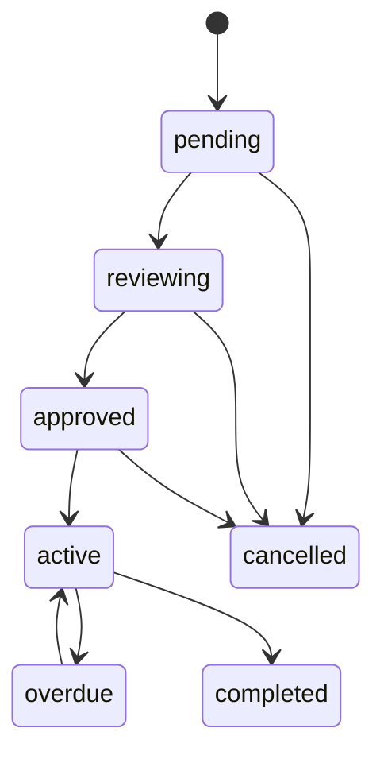

# 계약 시스템 (Contract)

## 계약 상태 (Contract Status)

| 상태 | 설명 |
|------|------|
| `pending` | 생성 직후 / 서류 대기 |
| `reviewing` | 내부 심사 |
| `approved` | 승인, 시행 전 |
| `active` | 계약 시행 중 |
| `overdue` | 납부 연체 등 이슈 |
| `completed` | 정상 종료 |
| `cancelled` | 취소·해지 |

## 상태 머신 (권장 전이)

데모 UI에서는 **모든 전이를 허용**하지만, 백엔드 도입 시 아래를 권장합니다.

## 관리 필드

- 고객 (`customerId`), 차량 (`vehicleId`)
- **신청 연결** (`applicationId` optional — 신청에서 mock 생성 시 설정)
- `startDate`, `endDate`
- `monthlyDueDay` (1–28 권장 — 월말 이슈 방지)
- `monthlyPaymentWon`, `depositWon`
- `status`, `memo`
- **`branchId`** — 소속 지점 (스코프·필터, `docs/BRANCH_SYSTEM.md`)
- **`autodebitStatus`** — 자동이체 **mock** 상태 (실제 은행·API 없음):  
  `not_registered` | `requested` | `active` | `failed` | `cancelled`

## `active` 전환 시 (4차)

- **차량 상태**: reducer에서 `reconcileVehicleStatuses` 로 `contracted` 등 반영.
- **월별 납부 스케줄**: `generatePaymentScheduleForContract` (`src/lib/payment-schedule.ts`) — `startDate`~`endDate`, `monthlyDueDay` 기준으로 `PaymentRecord`를 추가. 동일 `contractId`+`dueDate`가 있으면 **생성 생략**.
- **감사**: `contract.payment_schedule_generated` (건수 `detail`).

## `completed` / `cancelled` 전환 시 (4차 · mock 정책)

- 해당 계약의 **`scheduled` 납부는 `waived`로 일괄 전환** (미청구 처리). `paid`·`overdue`는 그대로 두어 수금 이력·미납 추적을 유지합니다.
- 감사: `payment.waive_scheduled_on_contract_close`.
- 차량은 `reconcileVehicleStatuses` 로 재정렬.

## `overdue`와 납부

- `applyRunMockAutomations` 에서 만기 지난 `scheduled` → `overdue` 후, 관련 계약을 `active`/`approved`에서 **`overdue`로 승격**할 수 있습니다 (`src/lib/mock-automations.ts`). 실제 채권 프로세스는 아님.

### 자동이체 mock (3차)

- 관리자 **`/admin/contracts`** 에서 생성·상세에서 `autodebitStatus` 선택.
- 고객 **`/lookup`** 에서 계약 연결 시 `not_registered` 이면 **자동이체 신청(mock)** 버튼 → `requested` (연락처가 계약 고객과 일치할 때만, 중복 신청 방지).
- `active` 인 경우 고객 조회 화면에 **다음 납부 예정일** 표시 (미납·스케줄 레코드 기준).

## 신청에서 생성 (mock)

- 조건·검증·상태 반영: `src/lib/contract-from-application.ts`
- 생성 직후 계약은 `pending`, 신청은 `contracted` + `linkedContractId` 설정.
- 차량 상태는 위 파일에서 `reconcileVehicleStatuses` 호출로 정렬.

## 감사·검증

- 금액 변경·기간 변경·상태 변경은 **서버에서 재검증** + 이벤트 로그 저장 권장
- 현재 클라이언트는 **memo 단독 수정 시 감사 로그 생략** (노이즈 감소), 금융 필드 변경 시 기록

## 만료 관리

- `endDate` 도래 시 `completed` 또는 연장 계약 생성  
- 배치 잡(크론)으로 `active` + `endDate < today` 탐지 후 알림 — 추후 구현
